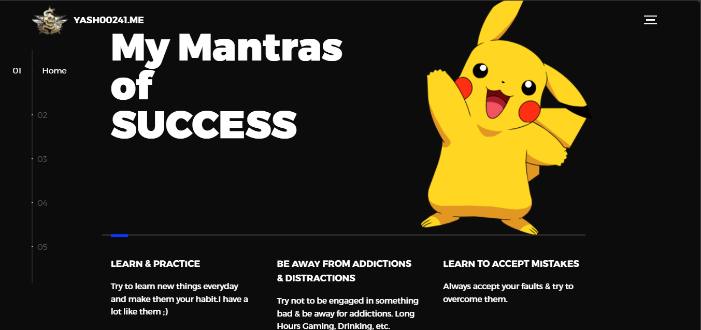
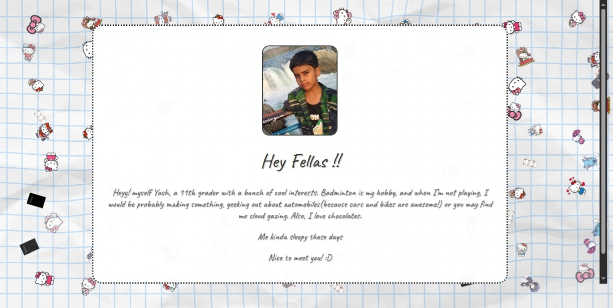
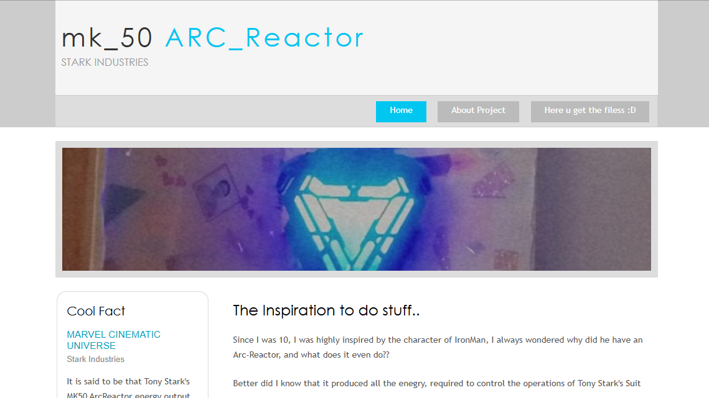

# 💼Portfolio Website  

Welcome to my **Personal Portfolio Website**! 🌟  

This is a one-stopp website which tells about me, my projects, and aspirations.  

---

## ✨ Features  

1. **Main Webpage** 🏡  
   - The starting panel of my webpage.  

2. **About Me** 😉 
   - An insight into who I am, my passions, and my goals.  

3. **The Inspiration - Hackclub** 🥰
   - It showcases about Hackclub and its events! 

---

## 📸 Website Screenshots  

  
*Screenshot of the Main Webpage* 

  
*Screenshot of the About Webpage*   

  
*Screenshot of the Arc Reactor*  
---

## Live Demo  

View the live website: **[Click Here!](https://yash00241.github.io)**  

---  

## Credits
- **Font**: *[Montserrat](https://www.1001fonts.com/montserrat-font.html)*
- **CSS**: *[normalize.css]https://git.io/normalize*
- **JS**: *[hammer.js](https://hammerjs.github.io/)*
- **JS**: *[jquery.js](https://jquery.com/download/)*
